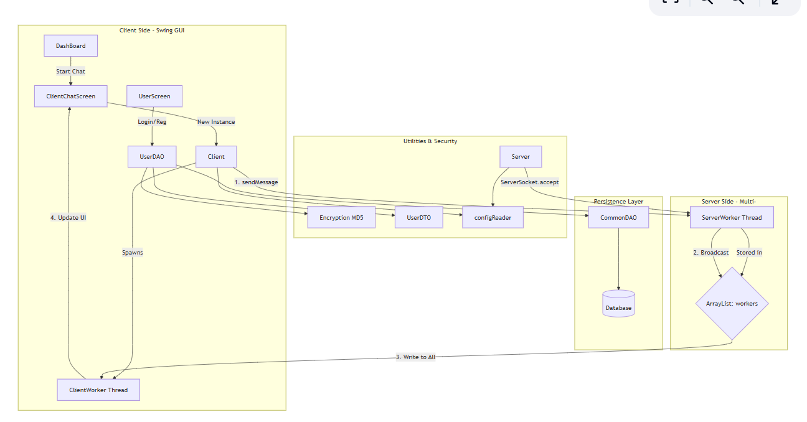

# Multi-User Chat Application

A Java Swing–based desktop chat application that allows multiple users to register, log in, and communicate with each other in real time using a client–server architecture.

---

## 📌 Project Overview

This project implements a real-time multi-user chat system using **Java Sockets** and **Multithreading**.  
Users must register and log in before accessing the chat interface.  
All messages sent by a user are broadcast to every connected client.

---

## ✨ Features

- User registration and login
- Secure authentication using encrypted passwords
- Real-time multi-user chat
- GUI built using Java Swing
- Client–server architecture using TCP sockets
- Multi-threaded server to handle multiple clients simultaneously
- MySQL database integration using JDBC
- Configuration-based setup using properties file

---

## 🛠️ Technologies Used

- **Java SE**
- **Swing (JFrame, JTextArea, JTextField, JButton)**
- **TCP/IP Sockets (ServerSocket, Socket)**
- **Multithreading**
- **JDBC**
- **MySQL**
- **MD5 Encryption**

---

## 🧱 Project Architecture

src/

└── com.harshproject.chatapp

├── dao → Database access layer

├── dto → Data Transfer Objects

├── network → Client & Server socket logic

├── utils → Configuration & encryption utilities

└── views → Swing GUI screens

---

## 🧩 System Architecture & Data Flow

The following diagram illustrates the high-level system architecture and data flow of the multi-user chat application:

### 🔹 Architecture Overview

This application is built using a **client–server architecture** with real-time communication using Java sockets and multi-threading:

✔ **Client (Java Swing GUI)**  
- Registers and logs in users  
- Sends/receives messages over TCP sockets  
- Updates UI in real time  

✔ **Server (Socket + Worker Threads)**  
- Listens for connections using `ServerSocket`  
- Spawns a new thread for each connected client  
- Broadcasts incoming messages to all active clients  

✔ **Persistence Layer (MySQL + DAO)**  
- Stores user credentials in a database  
- Provides authentication via JDBC  
- Separates database logic using DAO pattern  

✔ **Utility Layer**  
- Password encryption (MD5)  
- Configuration loaded from properties file  

---

### 🔹 Message & Data Flow (Simplified)

1. Client connects to the server  
2. Server accepts connection and creates a worker thread  
3. Client sends message over socket  
4. Server receives it and forwards it to all other clients  
5. Each client UI updates with the new message  

---

## 🧠 Design Highlights

- **Multi-threaded server** supports concurrent users  
- **Broadcast messaging** mechanism  
- **DAO pattern** for clean data access  
- **Real-time UI updates** with Swing  
- **Encrypted authentication**

---

---

## 🔐 Authentication Flow

1. User registers with username & password  
2. Password is encrypted using MD5 before storing in database  
3. On login, credentials are validated from MySQL  
4. Successful login opens the chat dashboard  

---

## 💬 Chat Flow

1. Server starts and listens on a port  
2. Each client connection runs on a separate thread  
3. Messages from one client are broadcast to all connected clients  

---

## 🗄️ Database

- MySQL database used for user authentication
- JDBC used for database connectivity
- DAO pattern implemented for clean separation of logic

---

## 🔮 Future Enhancements

- Private (one-to-one) messaging
- Online/offline user status
- Stronger encryption (SHA-256 / BCrypt)
- File sharing support
- Migration to Maven/Gradle

---

## 👨‍💻 Author

**Harsh Jha**  
GitHub: https://github.com/harshjha11

---

## 📄 License

This project is for learning and educational purposes.
